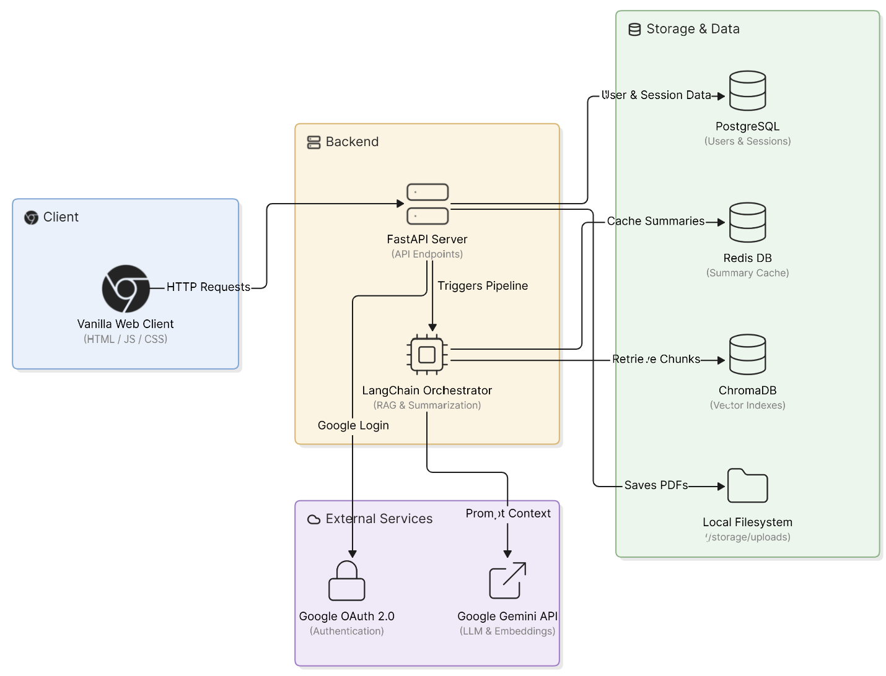

# ChatPDF 📄

Chat with any PDF using AI. Upload a document, ask questions about it, and get answers powered by Google Gemini.

## Architecture Diagram

---

## Core Features

- **Interactive Document Conversations** — Upload PDF files and query their contents.
- **Query Modes:**
  - **Search inside PDF (RAG)** — Performs semantic vector searches on document chunks using ChromaDB to answer specific questions based on the PDF context.
  - **Analytical Question** — Understands the full document context to answer broader questions.
- **Smart Redis Caching** — Caching summaries on a Redis database to optimize speed and cost.
- **Secure Authentication** — JWT authentication and Google OAuth login.
- **Saves all chat history** — Saves all chat history so you can revisit previous conversations.

---

## Tech Stack

- **Frontend:** HTML, JavaScript, Vanilla CSS
- **Backend:** FastAPI, Python
- **Orchestration:** LangChain
- **LLM and Embeddings:** Google Gemini
- **Vector Database:** ChromaDB
- **Relational Database:** PostgreSQL (SQLAlchemy)
- **Caching:** Redis

---

## Folder Structure

```text
ChatPDF/
│
├── backend/
│   │
│   ├── app/
│   │   │
│   │   ├── core/
│   │   │   ├── embeddings.py    # ChromaDB collections and vector storage operations
│   │   │   ├── rag.py           # semantic lookup and RAG prompt processing
│   │   │   └── summariser.py    # Map-Reduce chains with Redis summary caching
│   │   │
│   │   ├── db/
│   │   │   ├── database.py      # PostgreSQL connection and session configurations
│   │   │   ├── models.py        # SQLAlchemy models (User, Document, Session, ChatMessage)
│   │   │   └── crud/            # Database read/write (CRUD) operations
│   │   │       ├── chat_crud.py      # Messages history database storage
│   │   │       ├── document_crud.py  # Uploaded documents database management
│   │   │       ├── session_crud.py   # Chat sessions creation and listing queries
│   │   │       └── user_crud.py      # User authentication and registration database actions
│   │   │
│   │   ├── helper/
│   │   │   ├── auth_helper.py   # JWT encoding/decoding and bcrypt password hashing
│   │   │   └── document_helper.py # PDF text extraction and text splitting helpers
│   │   │
│   │   ├── routes/
│   │   │   ├── auth.py          # Signup, password login, and Google OAuth 2.0 routes
│   │   │   ├── chat.py          # Session chat queries and history endpoints
│   │   │   ├── documents.py     # File uploading and document list endpoints
│   │   │   └── sessions.py      # Session creation, listing, and closing endpoints
│   │   │
│   │   ├── schemas/
│   │   │   ├── auth_schemas.py  # Pydantic schemas for authentication
│   │   │   ├── chat_schemas.py  # Pydantic schemas for messaging
│   │   │   └── session_schemas.py # Pydantic schemas for sessions
│   │   │
│   │   ├── config.py            # Unified application environment config
│   │   └── main.py              # FastAPI main server entrypoint and route setups
│   │
│   └── requirements.txt         # Python dependencies
│
├── frontend/
│   │
│   ├── js/
│   │   ├── api.js               # Centralized fetch functions with JWT headers
│   │   ├── auth.js              # Auth status checks and tab switching UI logic
│   │   ├── chat.js              # Chat messages UI rendering, scroll sync, and indicator triggers
│   │   ├── dashboard.js         # File drag-and-drop zones and session cards rendering
│   │   └── utils.js             # General toasts and date/time formatting utilities
│   │
│   ├── styles/
│   │   ├── common.css           # Resets, global variables, cards, buttons, inputs, toasts, and spinners
│   │   ├── index.css            # Styling for index/login layout and card headers
│   │   ├── dashboard.css        # Upload boundaries, greeting sections, session grids, and badges
│   │   └── chat.css             # Chat messaging bubbles, scrollbars, textareas, and voice/action states
│   │
│   ├── chat.html                # PDF Chat interface page
│   ├── dashboard.html           # Document uploading and history dashboard
│   └── index.html               # User entry / Auth login page
│
├── storage/                     # Local storage directories
│   ├── uploads/                 # Stores uploaded PDF files
│   └── vectorstore/             # Stores persistent ChromaDB vector indexes
│
└── .gitignore
```

---

## Setup Instructions

### 1. Clone the Repository
```bash
git clone https://github.com/Swaroop883/ChatPDF.git
cd ChatPDF
```

### 2. Create and Activate Virtual Environment
```bash
python -m venv chatpdf-env

# Windows
chatpdf-env\Scripts\activate

# Mac/Linux
source chatpdf-env/bin/activate
```

### 3. Install Backend Dependencies
```bash
pip install -r backend/requirements.txt
```

### 4. Configure Local Environment
Create a `.env` file in the root directory and configure the environment variables (API keys, Database credentials, JWT settings, Google Client OAuth IDs, and Redis URL).

### 5. Launch Backend Server
Ensure PostgreSQL and Redis services are running on your computer, then start the FastAPI application:
```bash
cd backend
uvicorn app.main:app --reload
```

### 6. Open Frontend
Open `frontend/index.html` in your web browser.

---

## API Documentation

| Method | Endpoint | Description |
|---|---|---|
| **POST** | `/auth/register` | Create a new user account |
| **POST** | `/auth/login` | Login and receive a JWT token |
| **GET** | `/auth/google` | Login using Google OAuth |
| **POST** | `/document/upload` | Upload and process a PDF |
| **GET** | `/document/list` | List all uploaded documents of the user |
| **POST** | `/session/create` | Start a chat session associated with a document |
| **GET** | `/session/list` | List all user chat sessions |
| **POST** | `/chat` | Submit a question (RAG or summary mode) |
| **GET** | `/history/{session_id}` | Fetch full session conversation history |
| **DELETE**| `/session/close/{session_id}`| Close a session and clean up its vector embeddings |

---

## Future Improvements

1. **Voice Interactions (STT & TTS):** Use Speech-to-Text and Text-to-Speech models for voice conversation with the agent.
2. **React Migration:** Port the frontend to React instead of Vanilla HTML/CSS/JS.

---

## Author
Built by **Swaroop**
